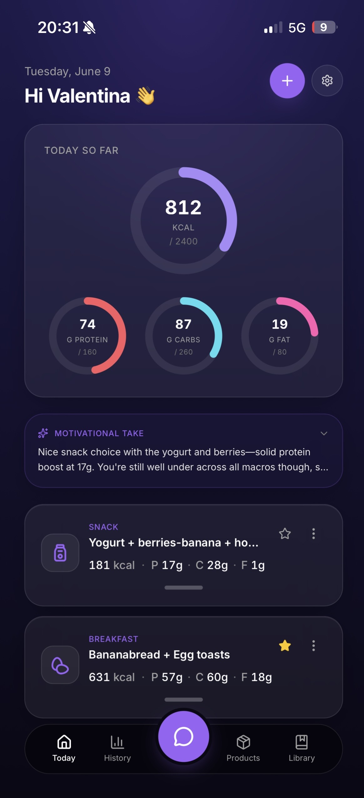
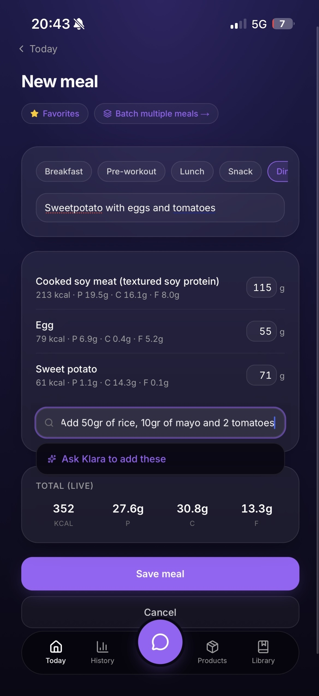
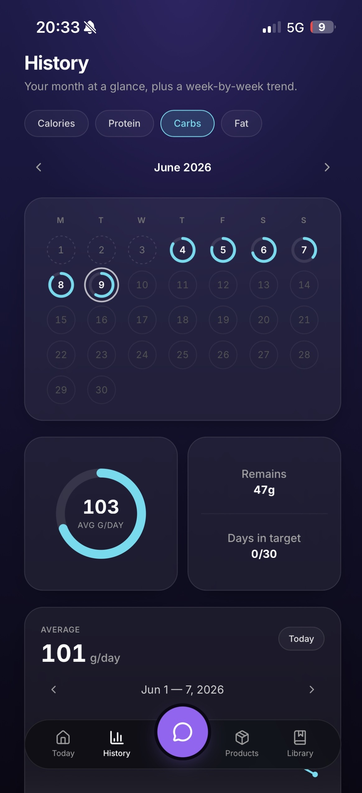
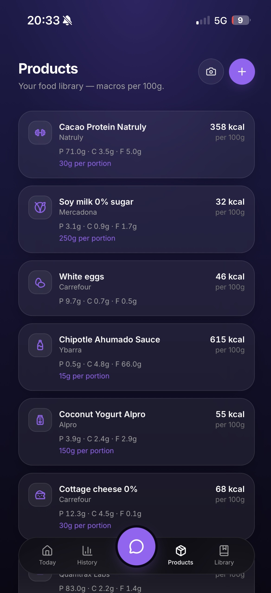

# Klara

> My personal nutrition assistant — built with Next.js, Postgres, and Claude. I log my meals (before or after I eat them) so I know what my day looks like, and the AI handles the boring macro math.

Klara is a nutrition tracker I built for myself. I tend to eat the same
things, so the real win is having my meals saved — I can re-add what I
always eat in a tap instead of re-entering it every time. I plan and log
my day to stay organized and hit my macros without obsessing over every
gram: I pick from my saved meals and food library, or just describe a
meal in plain language and Claude estimates the macros.

That's where Klara comes in: she evaluates my day after each meal I log,
and I can ask her anything, whenever I want — always with my actual
numbers in context. History shows how the month is going. It leans
vegetarian because that's how I eat, but nothing's locked to that.

It's a personal project — built for an audience of one (me), in public.

**Live demo:** https://klara-de-huevo.vercel.app

<p align="center">
  
  
  
  
</p>

## What's inside

- **Logging is fast.** I pick from my own products and recipes, paste a
  prose description, or batch a whole eating-out session in one go — and
  the meals I eat all the time are saved as one-tap favourites.
- **I can see where I stand.** A hero kcal ring + three macro rings on
  Today, and a colour-coded month grid + week-by-week line on History.
  Days that hit the target glow in the macro's colour; over-target days
  flip to red. I can tap any day to see the breakdown and edit it
  retroactively.
- **Klara gives me an honest take, not noise.** After every meal she
  writes a one-paragraph evaluation in the tone I picked (direct /
  motivational / neutral). It anchors on how the whole day compares to my
  targets, never the meal in isolation — so it won't tell me to "add more
  protein" on a day I'm already over.
- **I can just talk to her.** The Chat tab is a streaming conversation
  that rebuilds full context every turn: my profile, my daily goals,
  today's totals + meals, and a rolling seven-day summary. I ask "how am I
  doing on protein?" and the answer uses my actual numbers.
- **The AI does the boring work for me.**
  - I scan a label with my camera → Sonnet reads the macros.
  - I describe a meal in prose (even "1 avocado, half a cup of oats") → Sonnet turns it into structured entries.
  - I look up an ingredient by name → Sonnet fills in its macros.
  - I star a meal once → it becomes a one-tap favourite.

## Tech stack

| Layer     | What I use                                                                      |
| --------- | ------------------------------------------------------------------------------- |
| Framework | Next.js 16 (App Router, RSC, Server Actions, `after()`, streaming routes)       |
| Language  | TypeScript                                                                      |
| Styling   | Tailwind CSS 4 + custom CSS-variable design system (dark + violet + glass)      |
| Animation | Framer Motion (swipe-to-delete, sheet handle, drag interactions)                |
| Database  | PostgreSQL on Neon                                                              |
| ORM       | Prisma 6 — single `schema.prisma` source of truth                               |
| Auth      | Auth.js v5 with Google OAuth (split config for Edge vs Node)                    |
| AI        | Anthropic Claude — Sonnet 4.6 for vision + complex; Haiku 4.5 for fast          |
| Testing   | Vitest (~100 unit + snapshot tests) + Playwright (happy-path E2E)               |
| Deploy    | Vercel (preview per PR + production on `main`)                                  |
| Tooling   | ESLint, Prettier, GitHub Actions CI, Conventional Commits + labels + milestones |

## AI architecture

Klara has five LLM features, and they all share the same shape:

- A **stable system prefix** marked `cache_control: ephemeral` so
  Anthropic's prompt cache stays warm across calls.
- A **dynamic block** with today's numbers / latest exchange, never
  cached.
- A **tool-use schema** with Zod validation on the response, so
  Claude's structured output is parsed safely or rejected.

Two models, picked per task:

- **Sonnet 4.6** for vision (label scanning), parsing (free-text meal
  estimation + ingredient lookup), and chat — anything that benefits from
  instruction following and reliability.
- **Haiku 4.5** for the per-meal evaluations — high frequency, low
  latency, low cost.

The chat endpoint streams Server-Sent Events from a Next.js Route
Handler, piping Anthropic's `messages.stream()` deltas straight to the
client. The eval endpoint uses Next.js's `after()` so the user sees the
meal saved + "Klara is thinking…" skeleton immediately, while the
Anthropic call resolves out of the request lifecycle.

## Getting started

```bash
git clone https://github.com/valentinalorcap/klara-app.git
cd klara-app
nvm use            # uses Node 22 from .nvmrc
npm install
cp .env.example .env
# fill in DATABASE_URL, DIRECT_URL, AUTH_SECRET, AUTH_GOOGLE_*, ANTHROPIC_API_KEY
npx prisma migrate dev
npm run dev
```

App runs on http://localhost:3000.

See [CONTRIBUTING.md](./CONTRIBUTING.md) for project structure,
testing strategy, and the PR / commit conventions.

## Testing

```bash
npm test            # Vitest — unit + snapshot tests
npm run test:e2e    # Playwright happy-path (needs the dev server)
```

Vitest covers the pure helpers (macro math, goal + history aggregations) and the Anthropic prompt structure (a snapshot per tone). Playwright covers the main browser flows. The Anthropic SDK is mocked — I test the prompt/parser layer, not the model.

## Roadmap

Built in 11 phases — foundation, product library, label scanning, recipes, meal logging, daily goals, AI evaluations, batch logging, free-text estimation, chat, and a history calendar — each a `feat(phase-N): ...` milestone in the git log.

A small backlog of follow-ups (edit favourites from Library, an auto-maintained user memory, a few UX tweaks) is kept privately.

## Credits

Built by [Valentina Lorca](https://github.com/valentinalorcap), pair-programmed with Claude Code.
